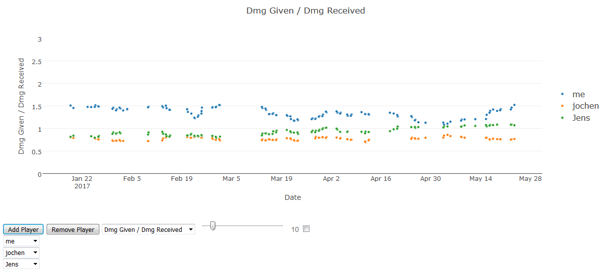
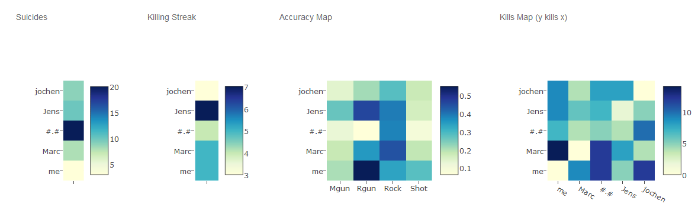
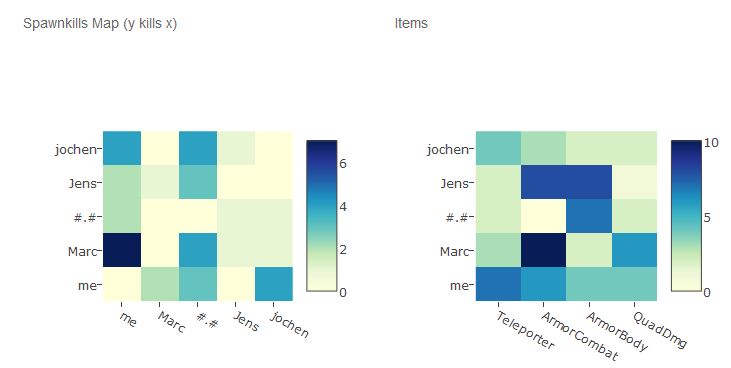
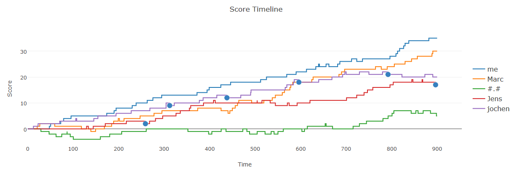

# Quake 3 Statistics

This is a website that visualizes quake 3 arena log data in different ways using [plotly](https://plot.ly/).
The server log file is parsed via javascript and the following visualizations are provided:

* Scatter plot showing different statistics (dmg given / dmg received ratio, accuracies) for each player over time. The values can be individually smoothed using a sliding window.
* Heatmaps showing suicides, killing streak, accuracy, kills, spawn kills, and picked items for a selected map.
* Scatter plot showing the frags and messages in the game chat over time for a selected map.

  

The log file is loaded in the function window.onload ([index.html](index.html)).

  
  

      
  
  
  

 

